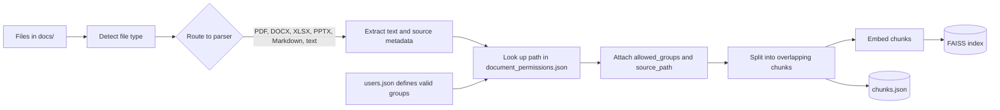
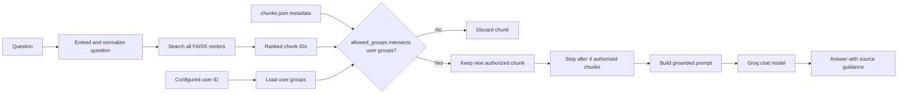

# KnowledgeGaurd

KnowledgeGaurd retrieves relevant company-document chunks, filters them by a configured user's groups, and uses Groq to answer questions from the permitted context. The evaluation tools check retrieval and access control separately from generated-answer quality.

## Architecture

KnowledgeGaurd has two flows: ingestion builds a searchable, permission-tagged corpus; question answering retrieves from that corpus and only passes authorized chunks to the language model.

### Document Ingestion



The ingestion graph routes each supported file to its format-specific parser. Permissions are attached using the document's repository-relative path before chunking; the splitter carries metadata into each chunk. The index stores vectors for similarity search, while `chunks.json` stores corresponding text and metadata. The chunk order must stay aligned with the FAISS row order.

### Question Answering



The app searches the shared index first, then filters the ranked results by `allowed_groups` before building the Groq prompt. Unauthorized chunks are not passed to answer generation. Searching all vectors before filtering lets an authorized match be found even when restricted chunks rank ahead of it; retrieval still returns no more than four authorized chunks.

The current app does not authenticate users. `USER_ID` in `app.py` selects a configured demo identity (currently `u002`, HR), and `users.json` supplies that identity's groups. This is a demonstration access-control boundary, not a replacement for application authentication, tenant isolation, or production security controls.

## How This Differs From A Typical RAG App

The core RAG pattern is the same: parse documents, chunk and embed them, retrieve relevant passages, then ask an LLM to answer from those passages. The differences are in access filtering and evaluation, not a different kind of language model or search algorithm.

| Area        | Typical basic RAG                             | KnowledgeGaurd                                                                                                                                  |
| ----------- | --------------------------------------------- | ----------------------------------------------------------------------------------------------------------------------------------------------- |
| Documents   | Often one format or a simple loader           | A LangGraph ingestion router dispatches PDF, DOCX, XLSX, PPTX, Markdown, and text to format-specific parsers.                                   |
| Permissions | Often one shared corpus for every user        | Chunks carry`allowed_groups`; retrieval keeps only chunks authorized for the configured user's groups before generation.                      |
| Retrieval   | Often asks the vector store for a fixed top-k | Searches the indexed vectors, filters by group, then keeps up to four authorized chunks. There is no reranker or relevance threshold.           |
| Identity    | May use an authenticated application identity | Currently selects a demo user ID from`users.json`; real authentication is not implemented.                                                    |
| Evaluation  | May rely on manual spot checks                | Includes fake-backed permission tests, a fact/source golden set, and an inventory check for docs, permissions, chunks, and FAISS row alignment. |

This does not make retrieval or answers automatically correct: vector similarity can miss relevant evidence, and Groq can still produce an incorrect answer. The golden evaluation measures retrieved facts and source metadata; it does not grade generated answer prose.

## Requirements

- Python and packages listed in `requirements.txt`.
- A Groq API key to run the interactive chat application.
- A populated `docs/` directory and matching entries in `document_permissions.json` to build the vector store.
- A local embedding model and vector store to run retrieval evaluation. The checked-in model and vector store can be used as-is.

Run commands from the repository root in PowerShell.

## Setup

Create and activate a virtual environment, then install dependencies:

```powershell
python -m venv .venv
.\.venv\Scripts\Activate.ps1
python -m pip install -r requirements.txt
```

Create `.env` only if it does not already exist, then add your Groq API key:

```powershell
if (-not (Test-Path .env)) { Copy-Item .env.example .env }
```

```env
GROQ_API_KEY=your_groq_api_key_here
```

The test and retrieval evaluation commands do not need a Groq key. The interactive app does.

## Build Or Refresh The Index

Run ingestion after adding or changing source documents or their permissions:

```powershell
python ingestion/app.py
```

Ingestion reads supported files from `docs/`, applies `document_permissions.json`, and writes the FAISS index and chunk records under `vector_store/`. It may download the embedding model and takes longer than the tests. Run the inventory check afterward to catch missing permission entries or stale indexed documents.

## Ask A Question

Start the interactive app:

```powershell
python app.py
```

Example question:

```text
How many vacation days do employees get?
```

The app loads the local embedding model and existing FAISS index. If the embedding model is not cached, it attempts to download it. It requires `GROQ_API_KEY` to generate answers. The demo currently uses user `u002` (HR), configured by `USER_ID` in `app.py`; use a different configured ID there to run the app as another user.

## Evaluation Commands

Run all deterministic, fake-backed unit tests:

```powershell
python -m unittest discover -s evaluation -p "test_*.py" -v
```

These tests check the retrieval access-control logic, including unauthorized high-ranked results, missing or malformed permissions, empty groups, invalid FAISS result IDs, and the result limit. They do not load the embedding model, FAISS index, or call Groq.

Run the golden retrieval cases against the actual local model and vector store:

```powershell
python evaluation/run_evaluation.py
```

This runs the questions in `evaluation/cases.json` for their configured users. It checks that expected fact phrases and source paths appear in retrieved chunks and that forbidden sources do not. It needs the dependencies, `models/all-MiniLM-L6-v2`, `vector_store/index.faiss`, `vector_store/chunks.json`, and `users.json`. It does not download the model or call Groq. Each case prints `PASS` or `FAIL`, followed by a total. It exits with code `0` when all cases pass, `1` when cases fail, or `2` when required dependencies/assets are missing.

Check the source, permission, chunk, and FAISS inventories:

```powershell
python evaluation/check_inventory.py
```

This checks that supported files in `docs/` have permission entries and indexed chunks, that chunk permissions match the configuration, and that the FAISS row count matches the chunk count. It exits with code `0` when aligned and `1` when it finds issues or required assets are missing.

Suggested verification order after changing documents or permissions:

```powershell
python -m unittest discover -s evaluation -p "test_*.py" -v
python evaluation/check_inventory.py
python evaluation/run_evaluation.py
```

The golden set evaluates retrieved evidence and group-based document access, not whether Groq's generated prose is correct. Update `evaluation/cases.json` when facts or approved source documents change, and keep its expected facts grounded in the source documents.
